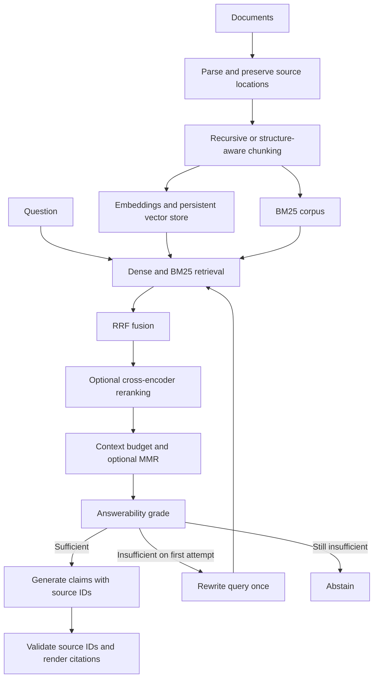

# RAG Insight

A compact document Q&A application for demonstrating retrieval experiments, evidence checks, and cited generation.

Upload documents → ask a question → inspect the answer, source passages, and retrieval trace.

## Status

This repository is a working local RAG application, not a validated benchmark or production service. It includes real pipeline adapters and a 24-question fictional benchmark. Model downloads, dependency installation, manual citation review, and end-to-end evaluation are required before making quality claims. No benchmark scores are fabricated.

## Quick start

Use Python 3.11 or newer. Run commands from this repository's root:

```powershell
py -m venv .venv
.\.venv\Scripts\Activate.ps1
python -m pip install -e ".[dev]"
```

`streamlit`, ChromaDB, PDF extraction, and the local application dependencies are installed by the base package. Copy `.env.example` only when you need to override the Ollama generation model or chat endpoint:

```powershell
Copy-Item .env.example .env
```

For scanned/image-only PDFs, install the optional local CPU OCR stack:

```powershell
python -m pip install -e ".[ocr]"
```

Install and run Ollama separately, then pull the configured model:

```powershell
# Run this only when Ollama is not already running as a Windows service.
ollama serve

# In a second PowerShell window:
ollama pull llama3.2
ollama pull nomic-embed-text
streamlit run app.py
```

The configured embedding backend is local Ollama (`nomic-embed-text:latest`), generation model is `llama3.2:latest`, and ChromaDB is the primary local vector store. SQLite remains the exact-search baseline. An unavailable Ollama/ChromaDB service or malformed model response produces an explicit error, not a fabricated answer.

## Run the application

1. Start Ollama, then run `streamlit run app.py` from the repository root.
2. Optionally select **Test embedding model** in the sidebar; it should report an embedding dimension.
3. Upload `.md`, `.txt`, or `.pdf` files. Rename duplicate filenames before uploading together.
4. For an image-only/scanned PDF, first install the OCR extra, enable **OCR scanned PDFs with local PP-OCRv5 (CPU)**, then choose **Inspect documents**. The PaddleOCR model downloads locally on first use.
5. Review the chunk inventory, then choose **Index documents**. Indexing calls Ollama for embeddings and persists the session-scoped ChromaDB collection locally.
6. Ask questions in the chat. Open **Sources** and **Tool and retrieval trace** to inspect grounding. Use **Reset chat** to clear conversation history or **Clear indexed collection** before changing index settings.

Chunk strategy, chunk size, overlap, embedding model, and vector-store settings form an index signature. Clear the collection or use a fresh browser session before re-indexing with different settings.

CLI alternative:

```powershell
rag-insight ingest data/sample_documents
rag-insight ask "Why was Redis selected?"
```

Use the same `--index` path for CLI ingestion and querying when you need an isolated collection. Enable local OCR for CLI ingestion with `--ocr`:

```powershell
rag-insight ingest data/sample_documents --index data/indexes/demo.sqlite
rag-insight ask "Why was Redis selected?" --index data/indexes/demo.sqlite
rag-insight ingest data/sample_documents --ocr --index data/indexes/ocr-demo.sqlite
```

Inspect parsing, provenance, and chunk boundaries without creating embeddings or an index:

```powershell
rag-insight inspect data/sample_documents --strategy recursive --format markdown --output artifacts/chunks/recursive.md
rag-insight inspect data/sample_documents --strategy structure --format markdown --output artifacts/chunks/structure.md
```

The inspection command loads the configured embedding tokenizer only. If that cannot load, it writes a clearly
labelled conservative character-budget artifact instead. Use `--strict-tokenizer` when model-token counts are
required. Its local outputs are ignored by Git.

## Architecture



## Repository map

| Path | Responsibility |
| --- | --- |
| `app.py` | Streamlit upload, Q&A, source viewer, trace download |
| `src/rag_insight/ingestion.py` | Markdown, UTF-8 text, PDF, and OCR-aware parsing |
| `src/rag_insight/chunking.py` | Recursive, structure-aware, and hybrid chunking |
| `src/rag_insight/embeddings.py` | Ollama and Sentence Transformers embedding adapters |
| `src/rag_insight/storage.py` | ChromaDB primary store and SQLite baseline |
| `src/rag_insight/retrieval.py` | Dense search, BM25, RRF, metadata filters, and MMR selection |
| `src/rag_insight/reranking.py` | Cross-encoder adapter |
| `src/rag_insight/generation.py` | Evidence grading, deterministic reducers, rewrite, and cited claims |
| `src/rag_insight/agent.py` | Read-only retrieval tool and bounded agent planner |
| `src/rag_insight/pipeline.py` | Ingestion, document registry, and bounded corrective orchestration |
| `src/rag_insight/llm.py` | Configurable Ollama HTTP adapter |
| `configs/` | Default pipeline and experiment variants |
| `evaluation/` | Offline benchmark runner, evidence labels, metrics |
| `data/sample_documents/` | Fictional corpus corresponding to benchmark labels |
| `data/uploads/`, `data/indexes/` | Ignored local documents and indexes |
| `artifacts/` | Ignored experiment results and reports |
| `tests/` | Retrieval, chunking, citation, and retry invariants |
| `docs/` | Decisions, evaluation methodology, remaining work |

## Evaluate

```powershell
.\.venv\Scripts\python.exe -m pytest
.\.venv\Scripts\python.exe -m ruff check src tests evaluation app.py
.\.venv\Scripts\python.exe -m evaluation.run
.\.venv\Scripts\python.exe -m evaluation.run --generate
.\.venv\Scripts\python.exe -m evaluation.run --generate --split test
```

Without `--generate`, only initial retrieval is measured; corrective variants therefore have identical retrieval behavior to their noncorrective counterparts. Generation mode additionally runs grading, one possible rewrite, final retrieval recall, and abstention scoring. Reports leave manual correctness/faithfulness/citation fields empty until reviewed. See [evaluation methodology](docs/evaluation.md).

## Deliberate limits

- SQLite stores vectors; dense retrieval performs an exact in-memory scan. This is appropriate for a small demonstration, not an ANN scalability claim.
- BM25 statistics are rebuilt from the current corpus per query. Both retrieval paths use the same chunks.
- Chunk and context budgets use the embedding tokenizer. The generator has a different tokenizer; reserve headroom and validate its limits before using larger contexts.
- OCR is supported locally through the optional PaddleOCR extra. General table reconstruction, authentication, background ingestion, and hosted multi-user operation remain outside this local application.
- Citation ID validation checks provenance, not whether each claim is semantically supported. That requires evaluation and potentially a separate verifier.
- The sample documents describe a fictional service. Their limits, endpoints, and operational behavior are benchmark evidence, not features of this app.

See [design decisions](docs/architecture.md) and [remaining work](docs/roadmap.md).
