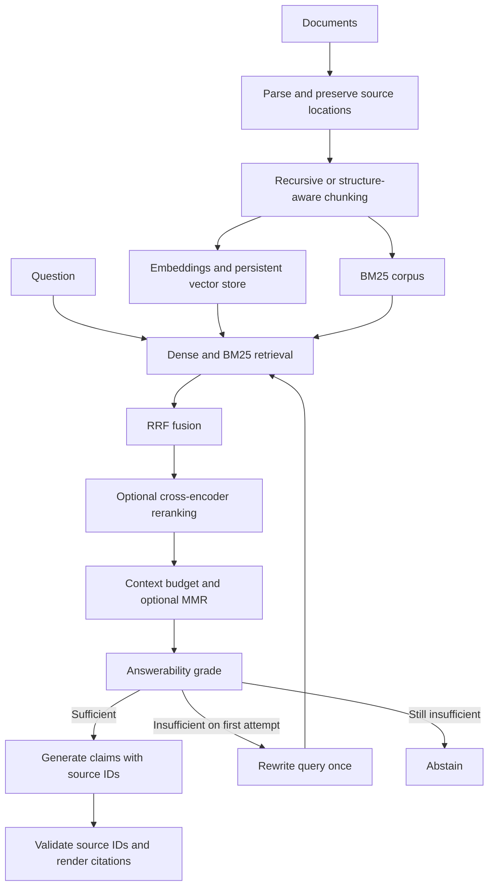

# RAG Insight

A compact document Q&A application for demonstrating retrieval experiments, evidence checks, and cited generation.

Upload documents → ask a question → inspect the answer, source passages, and retrieval trace.

## Status

This repository is an initial implementation scaffold, not a validated benchmark or production service. It includes real pipeline adapters and a 24-question fictional benchmark. Model downloads, dependency installation, and end-to-end execution are required before claiming working results. No benchmark scores are fabricated.

## Quick start

Use Python 3.11 or newer. Run commands from this repository's root:

```powershell
py -m venv .venv
.\.venv\Scripts\Activate.ps1
python -m pip install -e ".[dev]"
Copy-Item .env.example .env
```

Install and run Ollama separately, then pull the configured model:

```powershell
ollama pull llama3.2
streamlit run app.py
```

The first retrieval request/model initialization downloads Sentence Transformers models. Generation, grading, and rewriting use the Ollama endpoint in `.env`. An unavailable endpoint or malformed model response produces an explicit error, not a fabricated answer.

CLI alternative:

```powershell
rag-insight ingest data/sample_documents
rag-insight ask "Why was Redis selected?"
```

## Architecture



## Repository map

| Path | Responsibility |
| --- | --- |
| `app.py` | Streamlit upload, Q&A, source viewer, trace download |
| `src/rag_insight/ingestion.py` | Markdown, UTF-8 text, text-based PDF parsing |
| `src/rag_insight/chunking.py` | Chunk strategies, tokenizer budgets, source metadata |
| `src/rag_insight/embeddings.py` | Sentence Transformers embedding adapter |
| `src/rag_insight/storage.py` | SQLite persistence and document replacement |
| `src/rag_insight/retrieval.py` | Exact dense search, BM25, RRF, MMR selection |
| `src/rag_insight/reranking.py` | Cross-encoder adapter |
| `src/rag_insight/generation.py` | Evidence grading, rewrite, cited claims |
| `src/rag_insight/pipeline.py` | Ingestion and bounded corrective orchestration |
| `src/rag_insight/llm.py` | Configurable Ollama HTTP adapter |
| `configs/` | Default pipeline and experiment variants |
| `evaluation/` | Offline benchmark runner, evidence labels, metrics |
| `data/sample_documents/` | Fictional corpus corresponding to benchmark labels |
| `data/uploads/`, `data/indexes/` | Ignored local documents and indexes |
| `artifacts/` | Ignored experiment results and reports |
| `tests/` | Retrieval, chunking, citation, and retry invariants |
| `docs/` | Decisions, evaluation methodology, remaining work |

## Evaluate

```powershell
pytest
python -m evaluation.run
python -m evaluation.run --generate
python -m evaluation.run --generate --split test
```

Without `--generate`, only initial retrieval is measured; corrective variants therefore have identical retrieval behavior to their noncorrective counterparts. Generation mode additionally runs grading, one possible rewrite, final retrieval recall, and abstention scoring. Reports leave manual correctness/faithfulness/citation fields empty until reviewed. See [evaluation methodology](docs/evaluation.md).

## Deliberate limits

- SQLite stores vectors; dense retrieval performs an exact in-memory scan. This is appropriate for a small demonstration, not an ANN scalability claim.
- BM25 statistics are rebuilt from the current corpus per query. Both retrieval paths use the same chunks.
- Chunk and context budgets use the embedding tokenizer. The generator has a different tokenizer; reserve headroom and validate its limits before using larger contexts.
- PDF OCR, table reconstruction, authentication, background ingestion, and hosted multi-user operation are outside this scaffold.
- Citation ID validation checks provenance, not whether each claim is semantically supported. That requires evaluation and potentially a separate verifier.
- The sample documents describe a fictional service. Their limits, endpoints, and operational behavior are benchmark evidence, not features of this app.

See [design decisions](docs/architecture.md) and [remaining work](docs/roadmap.md).
